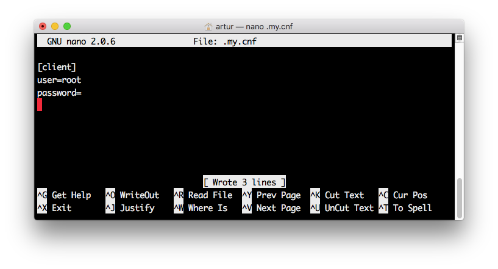
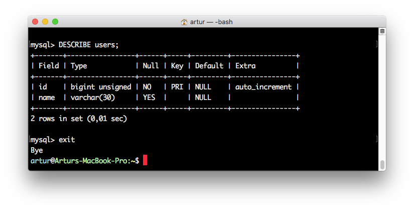
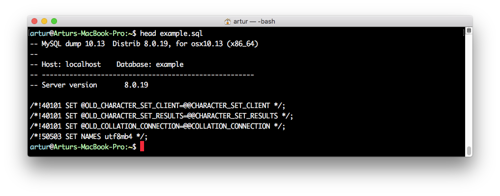
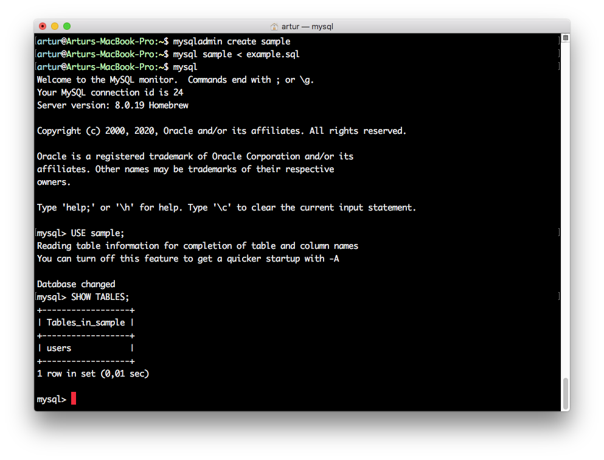

# Домашнее задание 2
**Задача 1** - Установите СУБД MySQL. Создайте в домашней директории файл .my.cnf, задав в нем логин и пароль, который указывался при установке.
```
nano .my.cnf
```

```
chmod go-r .my.cnf
```
**Задача 2** - Создайте базу данных example, разместите в ней таблицу users, состоящую из двух столбцов, числового id и строкового name.
```
mysql
CREATE DATABASE IF NOT EXIST example;
SHOW DATABASES;
USE example;
CREATE TABLE users (id SERIAL PRIMARY KEY,
                    name VARCHAR(30));
DESCRIBE users;
exit
```
  
**Задача 3** - Создайте дамп базы данных example из предыдущего задания, разверните содержимое дампа в новую базу данных sample.
```
mysqldump example > example.sql
head example.sql
```

```
mysqladmin create sample
mysql sample < example.sql
mysql
USE sample;
SHOW TABLES;
````
  
**Задача 4** - (по желанию) Ознакомьтесь более подробно с документацией утилиты mysqldump. Создайте дамп единственной таблицы help_keyword базы данных mysql. Причем добейтесь того, чтобы дамп содержал только первые 100 строк таблицы.
```
mysqldump -B mysql --tables help_keyword --where="true limit 100" > help_keyword_100.sql
```
