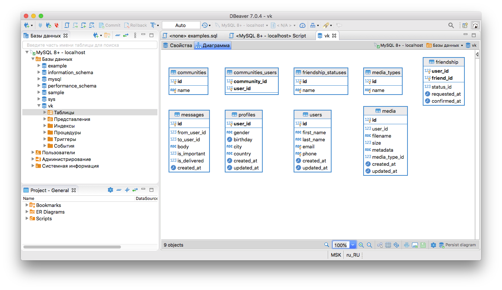
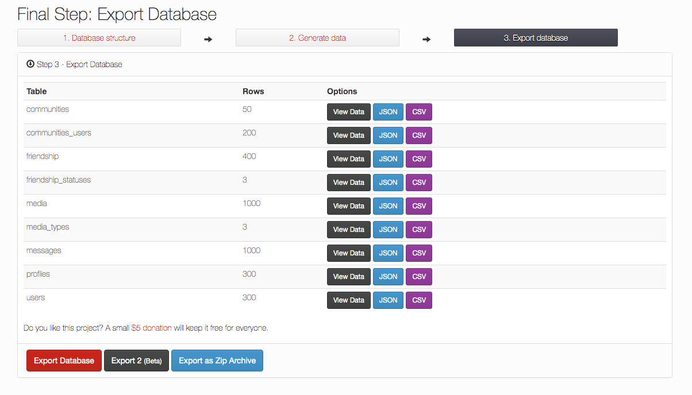
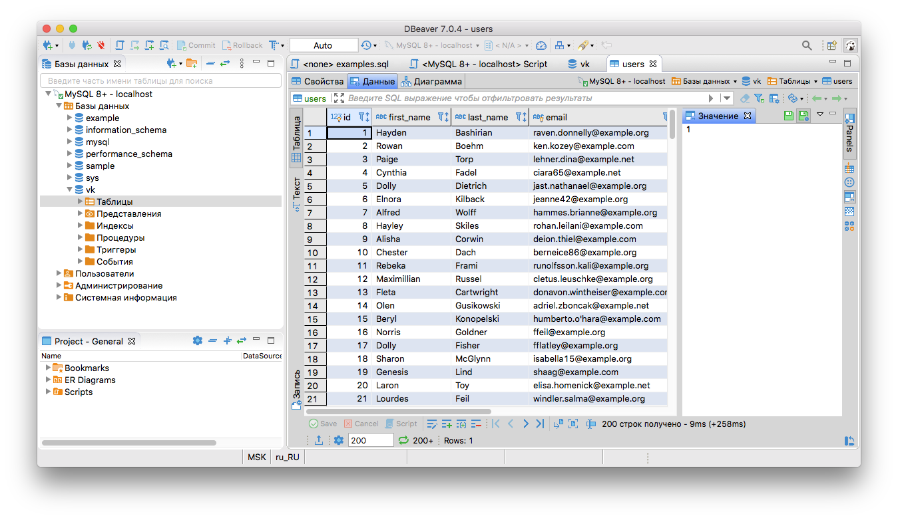

# Домашнее задание к уроку 3
**Задача 1** - Создать структуру БД Вконтакте по скриптам, приложеным в файле примеров examples.sql



**Задача 2** - Используя сервис http://filldb.info или другой по вашему желанию, сгенерировать тестовые данные для всех таблиц, учитывая логику связей. Для всех таблиц, где это имеет смысл, создать не менее 100 строк. Загрузить тестовые данные. Приложить к отчёту полученный дамп с данными.

1. Генерируем тестовые данные и сохраняем в файл.



2. Заливаем данные в базу vk
```
mysql vk < /Users/artur/Downloads/fulldb05-05-2020-12-01.sql
```
3. Проверяем, что база заполнена



4. Создаем дамп базы ([приложен к отчету](vk.sql))
```
mysqldump vk > vk.sql
```
**Задача 3** - (по желанию) Проанализировать структуру БД vk, которую мы создали на занятии, и внести предложения по усовершенствованию (если такие идеи есть). Напишите пожалуйста, всё-ли понятно по структуре.
1. Фото пользователя в профиле. Добавляем столбец **photo** в таблицу **profiles** с id из таблицы **media**
```
ALTER TABLE profiles ADD photo INT UNSIGNED FIRST;
```
2. Статус пользователя (active, blocked, deleted). Добавляем таблицу со статусами **user_statuses**. И столбец **status_id** в таблицу **users**.
```
CREATE TABLE user_statuses (
  id INT UNSIGNED NOT NULL AUTO_INCREMENT PRIMARY KEY,
  name VARCHAR(150) NOT NULL UNIQUE
);

INSERT user_statuses (id, name)
VALUES
  (1, 'active'),
  (2, 'blocked'),
  (3, 'deleted');

ALTER TABLE users ADD status_id INT UNSIGNED NOT NULL DEFAULT 1 AFTER phone;
```
3. Профиль пользователя открытый или закрытый. Добавляем столбец **is_private** в таблицу **profiles**
```
ALTER TABLE profiles ADD is_private BOOLEAN DEFAULT FALSE AFTER country;
```
