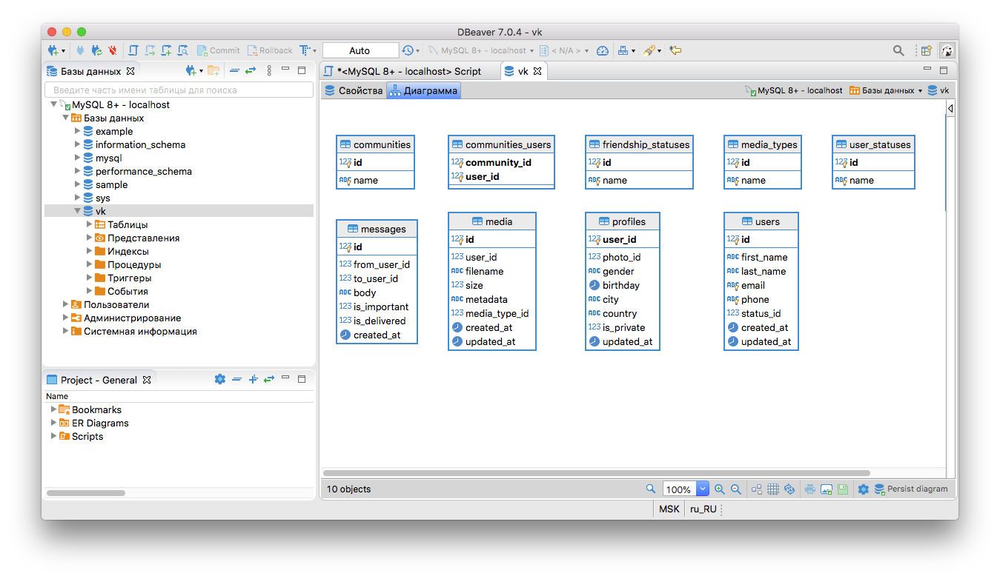

# Практическое задание по теме “CRUD - операции”  

**1.Повторить все действия по доработке БД vk.**

Готово.



**2.Подобрать сервис который будет служить основой для вашей курсовой работы.**

*Проект* – информационная система для компании, предоставляющей услуги покопийного сервиса печати.

*Бизнес модель* – компания берёт на полное обслуживание печатную технику заказчика, либо предоставляет свою. Заказчик платит за количество напечатанных страниц.
Необходима система, в которой будет вестись вся сервисная история по каждому устройству на обслуживании. Позволит проводить финансовую аналитику сервиса.  

*База данных:*
Центральная сущность – устройство (принтер, копир, МФУ). Необходимо вести историю ремонтов, записи счётчиков печати, у какого заказчика находится устройство, на гарантии или нет и т.д.
Кроме того необходимо организовать пользователей по ролям с разным уровнем доступа.

**3.(по желанию) Предложить свою реализацию лайков и постов.**
```
-- таблица постов со счетчиками просмотров и лайков
CREATE TABLE posts (
	id INT UNSIGNED NOT NULL AUTO_INCREMENT PRIMARY KEY,
	user_id INT UNSIGNED NOT NULL,
	header VARCHAR(255) NOT NULL,
	body VARCHAR NOT NULL,
	seens_count INT UNSIGNED NOT NULL,
	likes_count INT UNSIGNED NOT NULL
);

-- таблица лайков
CREATE TABLE likes (
	user_id INT UNSIGNED NOT NULL,
	post_id INT UNSIGNED NOT NULL
);

-- таблица медиа вложений к постам 
CREATE TABLE posts_media (
	post_id INT UNSIGNED NOT NULL,
	media_id INT UNSIGNED NOT NULL
);
```
