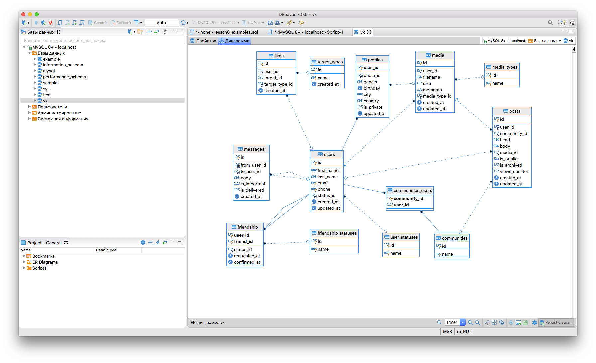

# Домашнее зазание к уроку 6.
***Сначала делаем задание 2, чтобы в БД были все таблицы***  

**Задание 2. Создать и заполнить таблицы лайков и постов.**
```sql
-- Таблица лайков
DROP TABLE IF EXISTS likes;
CREATE TABLE likes (
  id INT UNSIGNED NOT NULL AUTO_INCREMENT PRIMARY KEY,
  user_id INT UNSIGNED NOT NULL,
  target_id INT UNSIGNED NOT NULL,
  target_type_id INT UNSIGNED NOT NULL,
  created_at DATETIME DEFAULT CURRENT_TIMESTAMP
);

-- Таблица типов лайков
DROP TABLE IF EXISTS target_types;
CREATE TABLE target_types (
  id INT UNSIGNED NOT NULL AUTO_INCREMENT PRIMARY KEY,
  name VARCHAR(255) NOT NULL UNIQUE,
  created_at DATETIME DEFAULT CURRENT_TIMESTAMP
);

INSERT INTO target_types (name) VALUES 
  ('messages'),
  ('users'),
  ('media'),
  ('posts');
 
 SELECT COUNT(*) FROM posts;

-- Заполняем лайки
INSERT INTO likes 
  SELECT 
    id, 
    FLOOR(1 + (RAND() * 300)), 
    FLOOR(1 + (RAND() * 300)),
    FLOOR(1 + (RAND() * 4)),
    CURRENT_TIMESTAMP 
  FROM messages;

-- Проверим
SELECT * FROM likes LIMIT 10;

-- Создадим таблицу постов
CREATE TABLE posts (
  id INT UNSIGNED NOT NULL AUTO_INCREMENT PRIMARY KEY,
  user_id INT UNSIGNED NOT NULL,
  community_id INT UNSIGNED,
  head VARCHAR(255),
  body TEXT NOT NULL,
  media_id INT UNSIGNED,
  is_public BOOLEAN DEFAULT TRUE,
  is_archived BOOLEAN DEFAULT FALSE,
  views_counter INT UNSIGNED DEFAULT 0,
  created_at DATETIME DEFAULT CURRENT_TIMESTAMP,
  updated_at DATETIME DEFAULT CURRENT_TIMESTAMP ON UPDATE CURRENT_TIMESTAMP
);

-- Импортируем записи из сервиса  filldb.info
-- Проверяем заполнение таблицы
SELECT * FROM posts LIMIT 10;
```

***Задание 1. Создать все необходимые внешние ключи и диаграмму отношений.***
```sql
-- Смотрим структуру таблицы пользователей
DESC users;

-- Нужно поправить свойства солбца, сделать допустимым NULL значение    
ALTER TABLE users MODIFY COLUMN status_id INT UNSIGNED;  

-- Добавим внешний ключ на столбец status_id
ALTER TABLE users 
  ADD CONSTRAINT users_status_id_fk
  FOREIGN KEY (status_id) REFERENCES user_statuses(id)
    ON DELETE SET NULL;
   
-- Для таблицы профилей
-- Смотрим структуру таблицы
DESC profiles;

-- Добавляем внешние ключи
ALTER TABLE profiles
  ADD CONSTRAINT profiles_user_id_fk 
    FOREIGN KEY (user_id) REFERENCES users(id)
      ON DELETE CASCADE,
  ADD CONSTRAINT profiles_photo_id_fk
    FOREIGN KEY (photo_id) REFERENCES media(id)
      ON DELETE SET NULL;
     
-- Таблица связи communities_users
-- Смотрим структуру таблицы
DESC communities_users;

-- Добавляем внешние ключи
ALTER TABLE communities_users 
	ADD CONSTRAINT communities_users_user_id_fk
		FOREIGN KEY (user_id) REFERENCES users(id)
			ON DELETE CASCADE,
	ADD CONSTRAINT communities_users_comunity_id_fk
		FOREIGN KEY (community_id) REFERENCES communities(id)
			ON DELETE CASCADE;

-- Таблица дружбы friendship
-- Смотрим структуру таблицы
DESC friendship;

-- Нужно поправить свойства солбца, сделать допустимым NULL значение    
ALTER TABLE friendship MODIFY COLUMN status_id INT UNSIGNED;  

-- Добавляем внешние ключи
ALTER TABLE friendship
	ADD CONSTRAINT friendship_user_id_fk
		FOREIGN KEY (user_id) REFERENCES users(id)
			ON DELETE CASCADE,
	ADD CONSTRAINT friendship_friend_id_fk
		FOREIGN KEY (friend_id) REFERENCES users(id)
			ON DELETE CASCADE,
	ADD CONSTRAINT friendship_status_id_fk
		FOREIGN KEY (status_id) REFERENCES friendship_statuses(id)
			ON DELETE SET NULL;
			
-- Таблица media
-- Смотрим структуру таблицы
DESC media;

-- Нужно поправить свойства солбца, сделать допустимым NULL значение    
ALTER TABLE media MODIFY COLUMN media_type_id INT UNSIGNED;

-- Добавляем внешние ключи
ALTER TABLE media
	ADD CONSTRAINT media_user_id_fk
		FOREIGN KEY (user_id) REFERENCES users(id)
			ON DELETE CASCADE,
	ADD CONSTRAINT media_media_type_id_fk
		FOREIGN KEY (media_type_id) REFERENCES media_types(id)
			ON DELETE SET NULL;

-- Таблица messages
-- Смотрим структуру таблицы
DESC messages;

-- Добавляем внешние ключи
ALTER TABLE messages 
	ADD CONSTRAINT messages_from_user_id_fk
		FOREIGN KEY (from_user_id) REFERENCES users(id)
			ON DELETE CASCADE,
	ADD CONSTRAINT messages_to_user_id_fk
		FOREIGN KEY (to_user_id) REFERENCES users(id)
			ON DELETE CASCADE;
			
-- Таблица posts
-- Смотрим структуру таблицы
DESC posts;

-- Добавляем внешние ключи
ALTER TABLE posts 
	ADD CONSTRAINT posts_user_id_fk
		FOREIGN KEY (user_id) REFERENCES users(id)
			ON DELETE CASCADE,
	ADD CONSTRAINT posts_community_id_fk
		FOREIGN KEY (community_id) REFERENCES communities(id)
			ON DELETE SET NULL,
	ADD CONSTRAINT posts_media_id_fk
		FOREIGN KEY (media_id) REFERENCES media(id)
			ON DELETE SET NULL;
		

-- Таблица likes
-- Смотрим структуру таблицы
DESC likes;

-- Нужно поправить свойства солбца, сделать допустимым NULL значение    
ALTER TABLE likes MODIFY COLUMN target_type_id INT UNSIGNED;

-- Добавляем внешние ключи
ALTER TABLE likes 
	ADD CONSTRAINT likes_user_id_fk
		FOREIGN KEY (user_id) REFERENCES users(id)
			ON DELETE CASCADE,
	ADD CONSTRAINT likes_target_type_id_fk
		FOREIGN KEY (target_type_id) REFERENCES target_types(id)
			ON DELETE SET NULL;			
```
  

**Задание 3. Определить кто больше поставил лайков (всего) - мужчины или женщины?**
```sql
DESC likes;

-- Вариант 1 - через группировку результатов по полу
SELECT (SELECT gender FROM profiles WHERE user_id = likes.user_id) AS Пол,
       COUNT(user_id) AS Лайков 
    FROM likes GROUP BY Пол;

-- Вариант 2 - через объединение выборок по полу
SELECT 'Мужчины' AS Пол,
        COUNT(user_id) AS Лайков 
        FROM likes WHERE user_id IN (SELECT user_id FROM profiles WHERE gender = 'm')
UNION
SELECT 'Женщины' AS Пол,
        COUNT(user_id) AS Лайков 
        FROM likes WHERE user_id IN (SELECT user_id FROM profiles WHERE gender = 'w');
```

**Задание 4. Подсчитать общее количество лайков десяти самым молодым пользователям (сколько лайков получили 10 самых молодых пользователей).**
```sql
DESC profiles;

SELECT 	user_id, 
        (SELECT CONCAT(first_name, ' ', last_name) FROM users WHERE users.id = profiles.user_id) AS Name,
        (SELECT COUNT(id) FROM likes WHERE likes.target_id = profiles.user_id) AS Likes
	FROM profiles
	ORDER BY birthday DESC
	LIMIT 10;
```
**Задание 5. Найти 10 пользователей, которые проявляют наименьшую активность в использовании социальной сети  
(критерии активности необходимо определить самостоятельно).**
```sql
-- Критерии активности: суммарное кол-во постов, лайков и сообщений пользователя (исходящих от него)

SELECT 	id, 
		CONCAT(first_name, ' ', last_name) AS Name,
		(SELECT COUNT(*) FROM posts WHERE user_id = users.id)
		+
		(SELECT COUNT(*) FROM likes WHERE user_id = users.id)
		+
		(SELECT COUNT(*) FROM messages WHERE from_user_id = users.id) AS Activity
	FROM users
	ORDER BY Activity
	LIMIT 10;
```

