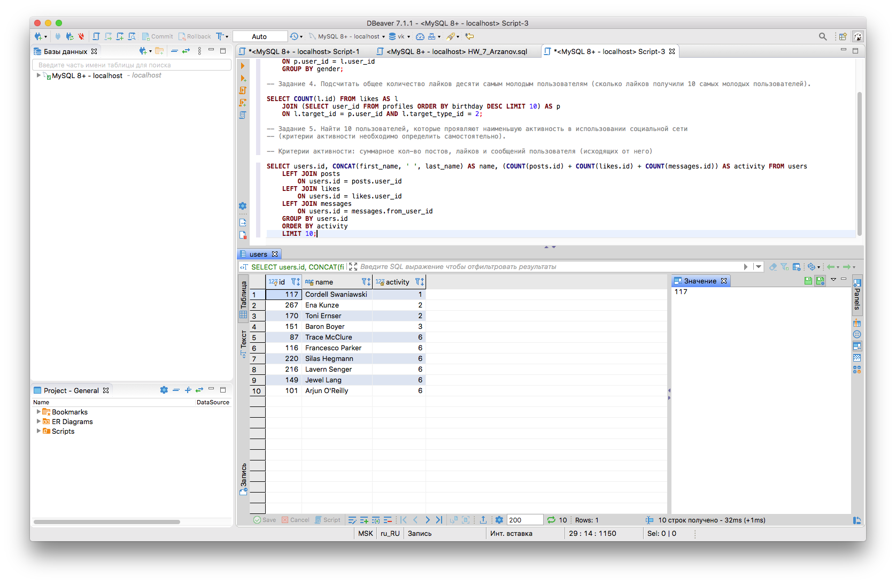
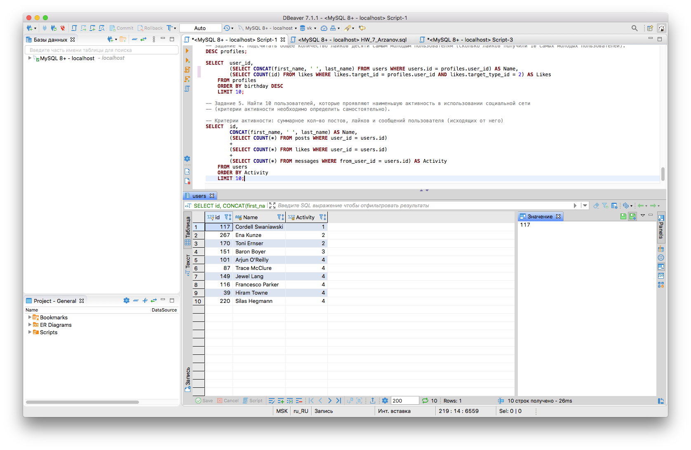

# Домашнее задание к уроку 8  
### Переписать запросы, заданые к ДЗ урока 6 с использованием JOIN  
**Задание 3. Определить кто больше поставил лайков (всего) - мужчины или женщины?**
```sql
DESC likes;
SELECT p.gender, COUNT(l.id) 'likes' FROM likes l 
	LEFT JOIN profiles p
	  ON p.user_id = l.user_id
	GROUP BY gender;
  ```
**Задание 4. Подсчитать общее количество лайков десяти самым молодым пользователям (сколько лайков получили 10 самых молодых пользователей).**
  ```sql
  SELECT COUNT(l.id) FROM likes AS l
	  JOIN (SELECT user_id FROM profiles ORDER BY birthday DESC LIMIT 10) AS p
	    ON l.target_id = p.user_id AND l.target_type_id = 2;
  ```
**Задание 5. Найти 10 пользователей, которые проявляют наименьшую активность в использовании социальной сети  
(критерии активности необходимо определить самостоятельно).**

**Критерии активности: суммарное кол-во постов, лайков и сообщений пользователя (исходящих от него)**
```sql
SELECT users.id, CONCAT(first_name, ' ', last_name) AS name, (COUNT(posts.id) + COUNT(likes.id) + COUNT(messages.id)) AS activity FROM users
	LEFT JOIN posts
	 	ON users.id = posts.user_id
	LEFT JOIN likes
		ON users.id = likes.user_id 
	LEFT JOIN messages
		ON users.id = messages.from_user_id
	GROUP BY users.id 
	ORDER BY activity
	LIMIT 10;
  ```
  
  **Не сходятся результаты по 5-му заданию. Не могу понять почему. Скриншоты ниже.**  
    
  
